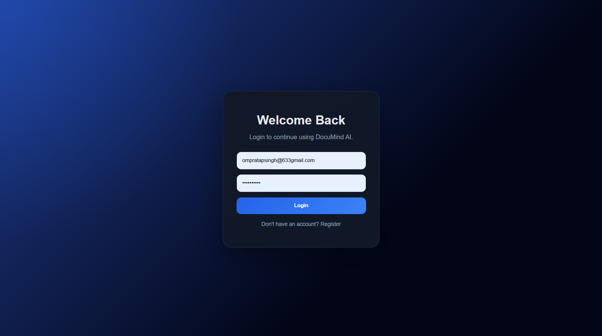
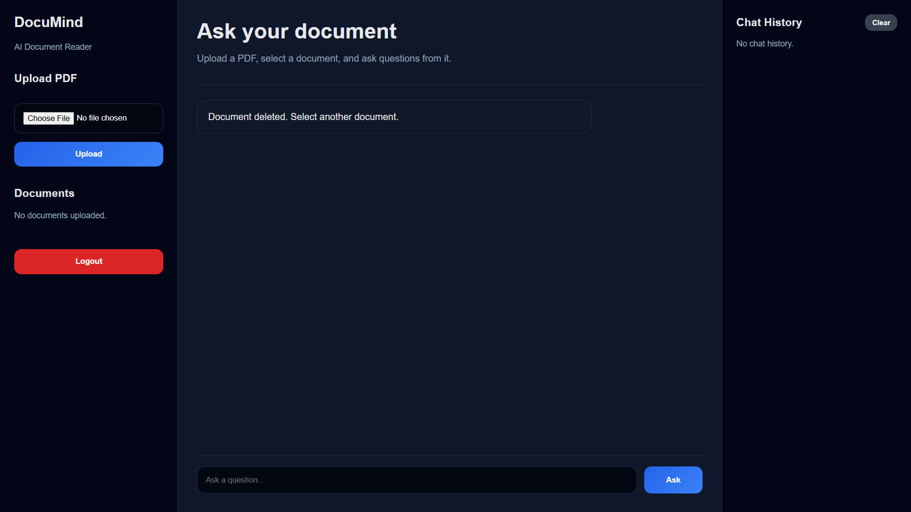
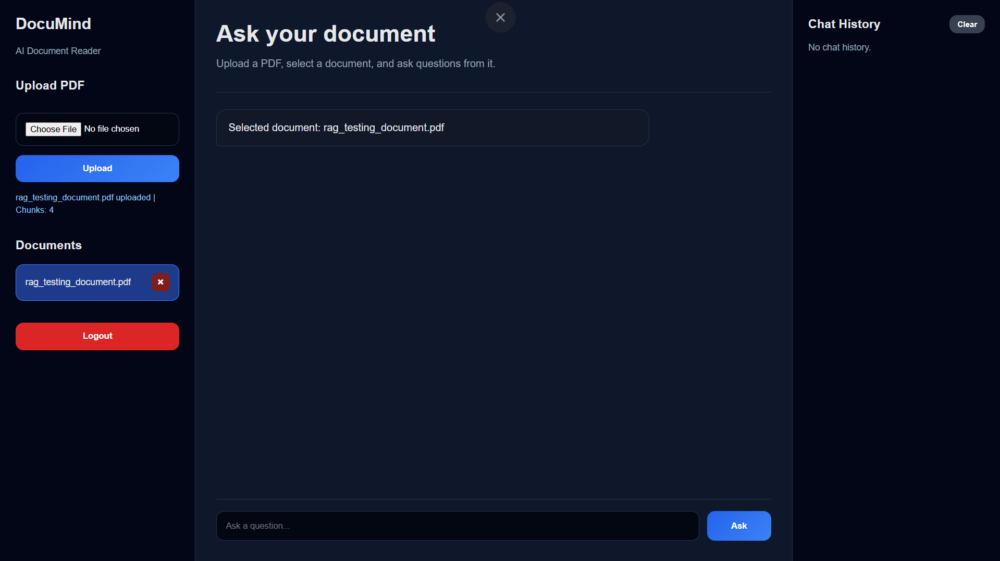
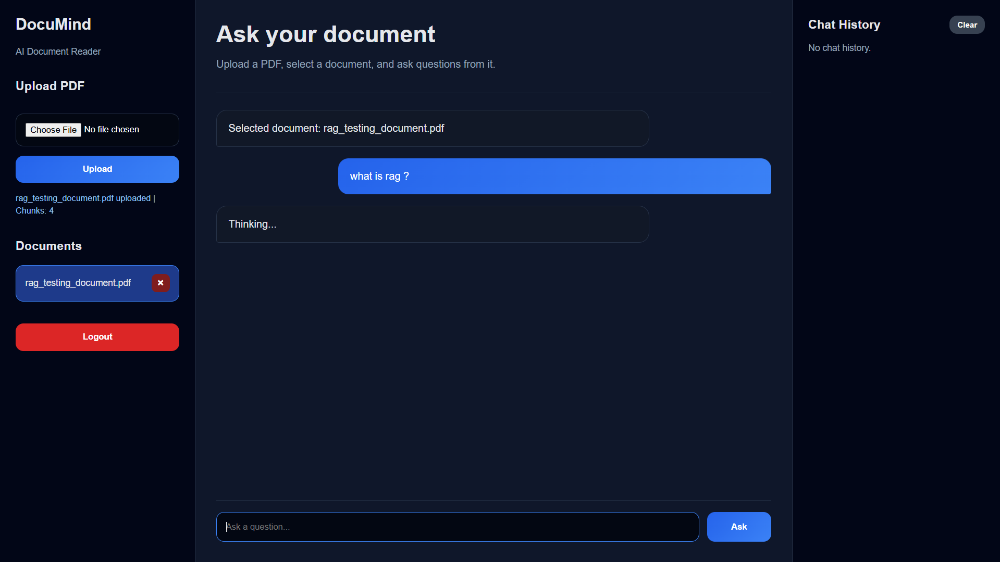
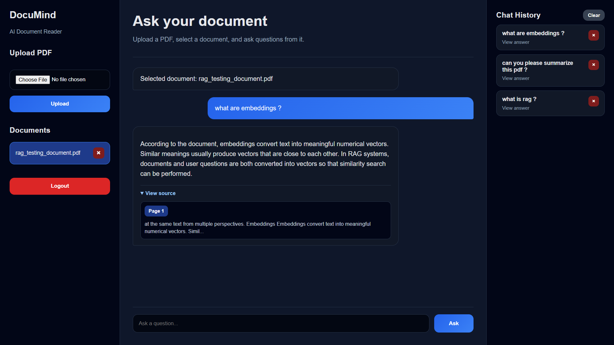

# 📄 DocuMind AI

DocuMind AI is a production-style Retrieval-Augmented Generation (RAG) chatbot that allows users to upload PDF documents and ask questions based strictly on document content.

The system combines semantic search, vector embeddings, and Large Language Models (LLMs) to generate accurate answers with source citations.

---

## 🚀 Features

### Authentication & User Management

* User Registration & Login
* JWT Authentication
* Multi-User Support
* User-specific Chat History

### Document Processing

* Upload PDF Documents
* Automatic Text Extraction
* Intelligent Text Chunking
* Vector Embedding Generation
* Chroma Vector Database Storage

### RAG Pipeline

* Semantic Search
* Context Retrieval
* LLM-Powered Answer Generation
* Source Citation with Page Numbers
* Reduced Hallucinations through Context Grounding

### Chat Management

* Persistent Chat History
* Delete Individual Conversations
* Clear Complete Chat History
* Document Deletion Support

### User Experience

* Responsive UI
* Clean Chat Interface
* Real-Time Question Answering

---

## 🏗️ System Architecture

```text
User
  │
  ▼
FastAPI Backend
  │
  ▼
PDF Upload
  │
  ▼
Text Extraction
  │
  ▼
Chunking
  │
  ▼
HuggingFace Embeddings
  │
  ▼
Chroma Vector Database
  │
  ▼
Semantic Retrieval
  │
  ▼
OpenRouter LLM
  │
  ▼
Answer + Source Citation
```

---

## 🛠️ Tech Stack

### Backend

* FastAPI
* SQLAlchemy
* SQLite
* JWT Authentication
* LangChain

### AI / RAG

* HuggingFace Embeddings
* Chroma Vector Database
* OpenRouter LLM
* Semantic Search
* Retrieval-Augmented Generation (RAG)

### Frontend

* HTML
* CSS
* JavaScript

---

## 📂 Project Structure

```text
AI-RAG-CHATBOT/
│
├── app/
│   ├── main.py
│   ├── database.py
│   ├── models.py
│   └── rag_pipeline.py
│
├── templates/
│   └── index.html
│
├── static/
│   ├── style.css
│   └── script.js
│
├── data/
├── vectorstore/
├── .env
├── requirements.txt
└── README.md
```

---

## ⚙️ Installation

### Clone Repository

```bash
git clone https://github.com/YOUR_USERNAME/documind-ai.git

cd documind-ai
```

### Create Virtual Environment

```bash
python -m venv venv
```

### Activate Environment

#### Windows

```bash
venv\Scripts\activate
```

#### Linux / Mac

```bash
source venv/bin/activate
```

### Install Dependencies

```bash
pip install -r requirements.txt
```

---

## 🔑 Environment Variables

Create a `.env` file:

```env
OPENROUTER_API_KEY=your_api_key
SECRET_KEY=your_secret_key
```

---

## ▶️ Run Application

```bash
uvicorn app.main:app --reload
```

Open:

```text
http://127.0.0.1:8000
```

---

## 🧠 How It Works

1. User uploads a PDF document.
2. Text is extracted from the document.
3. Text is split into smaller chunks.
4. Chunks are converted into vector embeddings.
5. Embeddings are stored inside ChromaDB.
6. User asks a question.
7. Semantic search retrieves relevant chunks.
8. Retrieved context is sent to the LLM.
9. The model generates an answer with source citations.

---

## 🚧 Engineering Challenges Solved

* Multi-user document isolation
* User authentication using JWT
* Chat history management
* Source citation generation
* Retrieval quality improvement using semantic search
* Reducing hallucinations through context grounding
* Efficient document chunking and retrieval

---

## 📸 Screenshots

### Login Page



### Landing Page



### PDF Upload



### Chat Interface



### Source Citation Output



---

## 🔍 Keywords

RAG, LLM Applications, AI Chatbot, LangChain, FastAPI, ChromaDB, Vector Database, Semantic Search, Generative AI, Retrieval Augmented Generation, Document Question Answering, HuggingFace Embeddings, OpenRouter, Production AI Systems

---

## 🔮 Future Improvements

* Streaming Responses
* Confidence Scores
* Multi-Document Search
* PostgreSQL Integration
* Docker Deployment
* Role-Based Access Control
* Cloud Vector Database
* Advanced Retrieval Techniques

---

## 👨‍💻 Author

**Om Pratap Singh**

AI Engineer

Sri Ganganagar, Rajasthan, India

<<<<<<< HEAD
> Note: This project is designed for local execution. Cloud deployment requires higher memory because local embedding models and ChromaDB are used.
=======
Portfolio: https://oms-portfolio-2reu.onrender.com/

LinkedIn: https://www.linkedin.com/in/om-pratap-singh-438247331/

GitHub: https://github.com/codes-with-om

---

> Note: This project is currently optimized for local execution. Cloud deployment requires additional memory resources because embedding generation and ChromaDB storage are performed locally.
>>>>>>> 9d44ca2 (add Screenshots in README)
